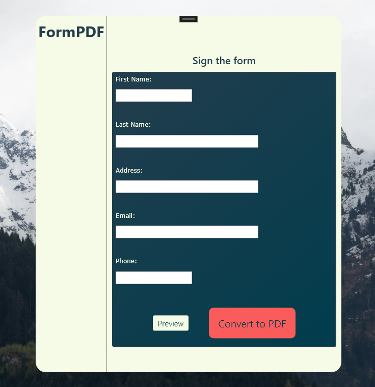
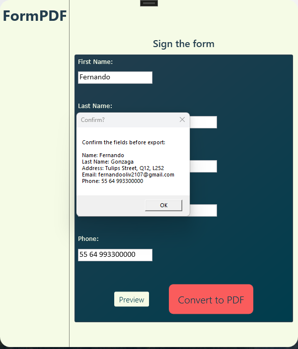
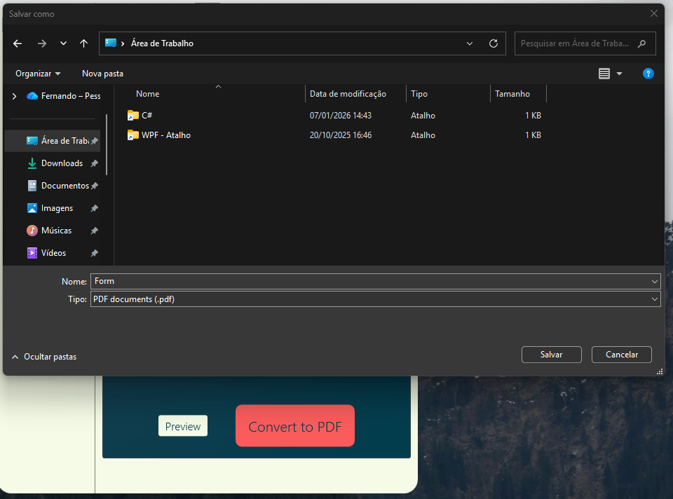
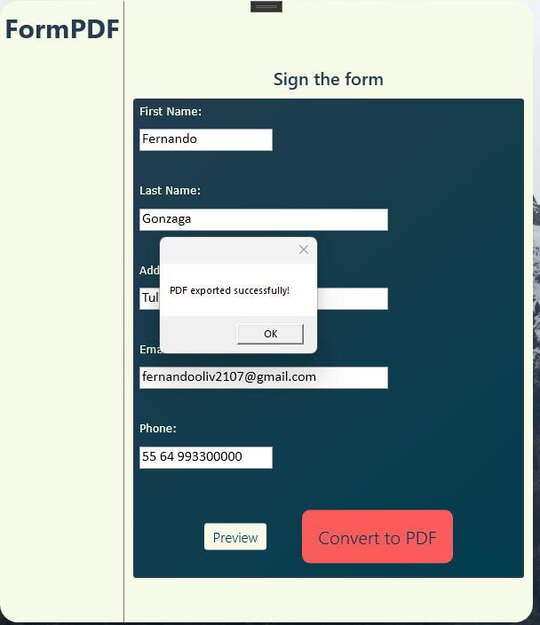
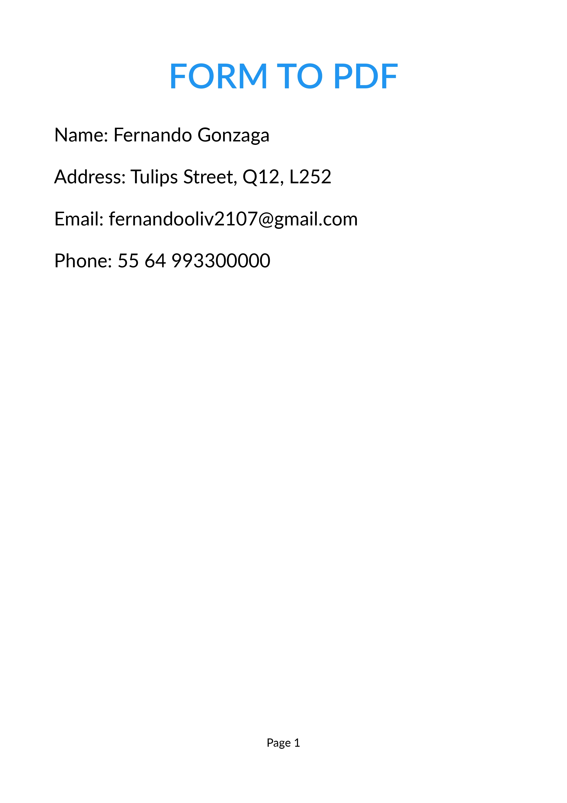

# FormToPDF - Projeto WPF para exportação em PDF

#### Aplicação WPF usando C# que recebe dados inseridos pelo usuário no formulário e exporta para PDF, com uso da biblioteca QuestPDF.

## Objetivo do projeto

Obter dados do usuário para exportação direta em PDF utilizando a biblioteca QuestPDF. O programa possui também um botão Preview, permitindo a visualização clara de que os dados estão atualizados para exportação.

## Tecnologias utilizadas

  - Visual Studio
  - .NET 9.0
  - C# 12.0
  - WPF
  - MVVM (padrão de projeto)
  - QuestPDF (biblioteca de criação de PDFs)
  - INotifyPropertyChanged (tecnologia utilizada que permite a comunicação síncrona entre View e ViewModel, onde o que é inserido no TextBox na aplicação sempre é atrelhado ao valor em si reservado para o dado)
  - ICommand (ICommand permite a associação de ação ao botão para exibir os dados atualizados no Preview)

## Principais funcionalidades

### Botão de Preview

Após inserir os dados, o usuário pode clicar no botão para visualizar os dados que serão utilizados na exportação e criação do PDF. Serve como um 'ponteiro' de que tudo que é inserido no momento é levado de fato ao documento.

### Botão Convert to PDF

Clicando no botão Convert to PDF, a aplicação realiza uma chamada do método Generate, localizado em Services/PdfGenerator.cs. Essa chamada inicializa o modelo de PDF criado com a importação da biblioteca QuestPDF, configurado para receber os dados inseridos pelo usuário e captado pelo INotifyPropertyChanged. A aplicação está configurada para habilitar uma alocação personalizada do arquivo onde o usuário melhor entender:

Após a inserção do local, a aplicação retorna com uma mensagem de confirmação de exportação dos dados e abre o PDF automaticamente:

PDF aberto no Google Chrome:

## Licença

Distribuído sob licença MIT.
   

## Autor

Desenvolvido por Fernando Gonzaga:

  - Linkedln: https://www.linkedin.com/in/fernando-gonzaga21/
  - GitHub: https://github.com/fernandoGonzaga0
